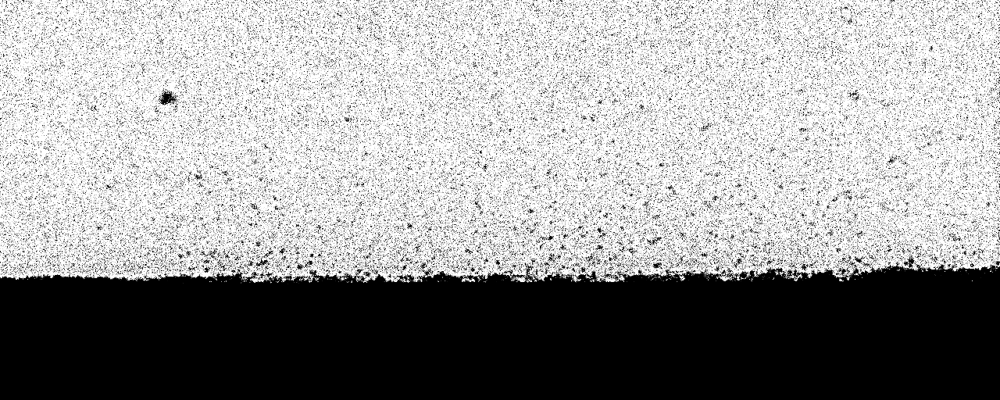

*********
Tutorials
*********

Segmentation of X-ray images
############################

This tutorial looks at building a segmentation model to classify regions in an X-ray image of an 
additive layer manufacturing process. In the process a laser beam is shone across a material 
surface and debris spatters up from the material. We want to build a model that can identify 
the regions of debris spattered up from the surface.

To do this we will use a U-net architecture. There are some challenges in using most U-net 
architectures that you will find on the web.

   (i) The image sizes are very large. This means that the image and the model cannot fit 
   together in the memory.

   (ii) The classes are very imbalanced. There is 98% nothing to see in the images, so the
   model finds it very easy to classify everything as background and feel satisfied.

To overcome the first problem we will use a routine in `superres-tomo` to create patches from 
the image and learn sequentially from each patch. To do do this we have implemented the 
`image_models.data_handeling.generators.mask_patch_from_file` function which acts as a 
generator to feed the network for training.

To overcome the issue of class imbalance we will use a special loss function called 
:meth:`image_models.models.losses.custom_loss_functions.weighted_cross_entropy`. 
Regular crossentropy on a binary segmentation peanilises equally
for false positives and false negatives. However, in our case false positives will be 
very rare and false negatives much more common, due to 98% of the image being 'positive'.
`weighted_cross_entropy` applies a factor to the loss function to increase or decrease the 
penalty for false positives. If this factor is greater than 1 then it adds greater weight
to a loss for a false positive, if it is less than 1 it reduces this weight.

Step 1
~~~~~~

The first step is to set up the training data in the correct formats and directories.
We will take an original large image and mask, and convert them into smaller windows
of the originals, in the appropriate directories for the later training. We use the 
`image_models.utils.alm.tools.image_to_windows` function in to do this. 
The original image and mask files should be on their own in individual directories.

.. code:: python

   import srtomo 
   from utils.alm.tools import image_to_windows

   ## Convert the training images to windows
   patch_origin = <tuple (x, y)>
   patch_size = <tuple (x, y)>
   ftypes = <list eg ['.tif']>
   num_patches = <int >

   ### First the image
   datapath = <the directory where the image file is>
   savepath = <the directory to save the patches to>
   prefix= <prefix to give the patch files>
   image_to_windows(datapath, ftypes, patch_size=patch_size, patch_origin=patch_origin, 
                 savepath=savepath, prefix=prefix, num_patches=num_patches)

   ### Next the mask
   datapath = <the directory where the mask file is>
   savepath = <the directory to save the patches to>
   prefix= <prefix to give the patch files>
   image_to_windows(datapath, ftypes, patch_size=patch_size, patch_origin=patch_origin, 
                    savepath=savepath, prefix=prefix, num_patches=num_patches)

Step 2
~~~~~~

Once the data is in place we are ready to start setting up the U-net.
Tell the code where to find the images and masks, the types of file to
expect.

.. code:: python

   datapath=<the root directory of images and masks>
   img_dir=<the subdirectory where images are>
   mask_dir=<the subdirectory where masks are>
   ftypes=(<filetypes to look for>) # e.g. ('.tif')

Step 3
~~~~~~

Set up the information about the size of the original image and the size of the 
patches to take from the image. Also here you can define a list of which patches
to use. This last feature is useful when the interesting features are only in a
section of the image. You can specify the particular patches to consider for the 
training. The numbering of patches starts from zero and proceeds left to right 
top to bottom. If the patch list is left empty the generator uses all patches.

.. code:: python

   image_shape = (512, 1280)
   patch_shape = (64, 64)
   patch_range = [31, 32, 33, 34, 39, 62]

Step 4
~~~~~~

Set up the generator. This is the function that will flow the patches from the images
to the netowrk for training.

.. code:: python

   from data_handeling.generators import mask_patch_from_file

   myGene = mask_patch_from_file(datapath,
                              img_dir, mask_dir,
                              patch_shape, image_shape,
                              types = ftypes, patch_range=patch_range,
                              debug=False,
                              batch_size = 1,
                              normalise_images=False)

Step 5
~~~~~~

Define the netowrk architecture, the hyperparameters and the training time.
Here the input size is the dimension of the patches, also we have just 1 
channel as the image is greyscale. We use a standard SGD optimiser. The 
`weighted_cross_entropy` loss function is set up with a factor of 7 to help
counter the class imbalance.

.. code:: python

   from models.u_net.model import unet
   import models.losses.custom_loss_functions as losses

   model = unet(input_size = (patch_shape[0], patch_shape[1], 1))
   opt = SGD(lr=1e-3, momentum=0.4, decay=1e-4 / epochs)
   model.compile(loss=losses.weighted_cross_entropy(7), optimizer=opt,
              metrics=["accuracy"])

Step 6
~~~~~~

Train and save! 

.. code:: python

   epochs = 5
   steps_per_epoch = 800
   model.fit_generator(myGene, steps_per_epoch=steps_per_epoch, epochs=epochs)
   model.save_weights('saved_weights.hdf5')
   with open('model.yaml', "w") as yaml_file:
       yaml_file.write(model_yaml)

Step 7
~~~~~~

Run the model for inference. Having trained the model on some images you can now try to deploy on
new examples. We have the :meth:`image_models.utils.tools.inference_binary_segmentation` helper
function to do this. First we load up the saved model and weights.

.. code:: python

   from image_models.utils.tools import inference_binary_segmentation
   from keras.models import model_from_yaml

   datapath = './test_images/'
   patch_shape = (64, 64) 
   image_shape = (512, 1280)
   model_file = 'model.yaml'
   weights_file = 'saved_weights-1.hdf5'
   savepath = './inferred_masks/'

   # load YAML and create model
   yaml_file = open(model_file, 'r')
   loaded_model_yaml = yaml_file.read()
   yaml_file.close()
   loaded_model = model_from_yaml(loaded_model_yaml)
   # load weights into new model
   loaded_model.load_weights(weights_file)

   inference_binary_segmentation(datapath, patch_shape, image_shape, loaded_model,
                    file_prefix='binary_mask', savepath=savepath, fig_size=(20, 8))

In the `inferred_masks` directory there should now be a masking file something like:

.. image:: figures/x-ray-mask.png
